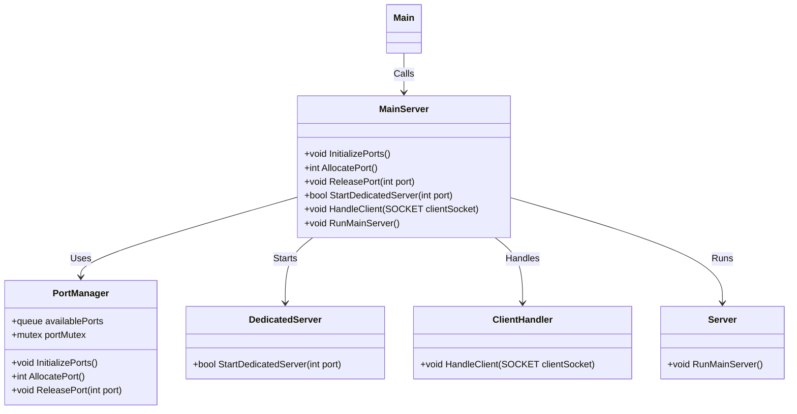
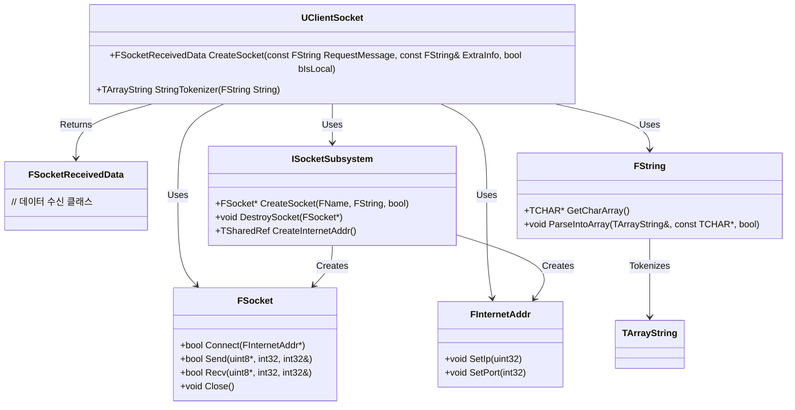

# 졸프 시스템 아키텍처

# 전체 개요

## 클라이언트 - 서버 구조

- Dedicated Server 구조로 동작. 해당 서버가 모든 게임 로직의 권위를 가지며 해당 서버는 어떤 플레이어에도 속하지 않는다.
- 클라이언트에서는 입력 처리, 시각화, 일부 예측 로직(Client-Side Prediction)만을 담당
- 게임 상태는 서버가 실제 값을 관리하고, 필요한 정보만 클라이언트에게 복제

## Gameplay Ability System

- 플레이어 및 AI의 스킬, 능력치(Attributes), 버프/디버프(Effects)등을 통합하여 관리한다
- Ability(능력)마다 활성화 조건(시작하자마자.. 혹은 버프를 실행 시..), 대상, 실행 로직을 정의
- Attribute는 캐릭터의 체력, 스태미나, 공격력, 방어력 등을 포함
- GameplayEffect를 통해 버프/디버프 지속 시간, 중첩, 제거 로직 등을 서버에서 적용
- 서버가 Ability와 Effect의 발생, 적용을 결정하고 클라이언트는 이를 기반으로 애니메이션, 혹은 FX, 사운드 등을 재생

## 게임 스타일 핵심 요소

- 적을 처치하거나 피하면서 지름길을 찾고, 그 지름길을 활용하며 필드의 더 깊은 곳을 진행하거나 숨겨진 요소들을 찾는 등 다양한 방법으로 탐험 가능한 필드
- 투박하나 세심한 근접 전투 시스템 : 공격 / 회피 / 가드 / 무기스킬 등 제한된 수의 행동으로 수많은 경우의 수를 풀어나가는 전투
- 플레이어의 현재 행동뿐만 아니라 플레이어의 과거의 행동도 참고하여 그에 다르게 작동하는 제한된 메모리 AI
- 다양한 무기들의 특성을 플레이어의 취향에 맞게 조합함으로서 본인의 스타일에 맞는 무기를 만들어가는 무기 조합 시스템

# Network

## Network Logic

### Main Server

모든 Dedicated Server들을 관리. 클라이언트와 신뢰성있는 TCP로 통신한다.

클라이언트에게 방 생성 요청을 받으면 Dedicated Server를 특정 포트에 실행한 뒤, 해당 정보를 클라이언트에 전달한다.

또한 플레이어 순위, 정보 등 주요 정보를 저장하기 위해 Firebase와 연동한다

### Dedicated Server

Main Server에 의해 관리되는 독립형 서버. 하나의 게임 세션에서 데미지, AI 관리 등 다양한 요소들을 관리. 어떠한 플레이어에도 속하지 않고 독립적으로 돌아가기 때문에 특정 클라이언트에 유리한 게임이 되지 않는다.

### Client

플레이어가 속해있는 게임. 입력 처리와 애니메이션, 사운드 재생 등의 재생을 담당한다.

MainServer에 방 생성이나 참가를 요청한다. MainServer에서 전달받은 IP와 Port를 통해 특정 Dedicated Server 게임 세션으로 접속한다.

Online Subsystem Steam을 통해 스팀 친구 초대, 세션 검색, 업적 시스템 연동 등을 사용한다

### Network 구조도

# 인게임 스탯 및 능력 상호작용

## GameAbility

- *Gameplay Ability System(GAS)**을 활용하여 플레이어와 몬스터의 능력을 통합적으로 관리합니다.

`UAbilitySystemComponent`를 기반으로 하며, `GameplayAbility`, `GameplayEffect`, `AttributeSet`이 유기적으로 동작합니다. Unreal에서 제공하는 해당 클래스들을 기반으로 파생 클래스를 만들어 프로젝트에 맞춰 개발할 예정입니다.

### **핵심 요소**

- **Gameplay Ability**:
    - 능력(공격, 회피, 특수 행동 등)을 정의
    - 초기 능력은`UDataAsset_StartUpDataBase`에서 능력을 불러와
     `UAbilitySystemComponent`에 등록
    - 능력 활성화 및 실행 로직 포함 (`ActivateAbility`)
- **Gameplay Effect**:
    - 능력 사용 시 적용되는 효과(버프, 디버프, 상태 이상 등)
    - `Duration`, `Magnitude`, `Stacking` 등의 속성 포함
    - 서버가 적용 여부를 결정하며 클라이언트는 이를 기반으로 애니메이션 및 VFX 재생
- **Attribute Set**:
    - 캐릭터의 능력치(체력, 스태미나, 공격력 등)를 정의
    - `UDDSAttributeSet`을 상속받아 특정 속성을 커스텀 가능

## Attribute 및 Effect

## Weapon

## DataAsset

# 사용 툴

Git : 협업 툴

Unreal Engine : 메인 게임 엔진

Google SpreadSheet : 데이터 파싱 & 수정 & 관리

AWS : MainServer 운영

Firebase : 플레이어 순위, 정보 저장

C++ : 주 개발 언어
